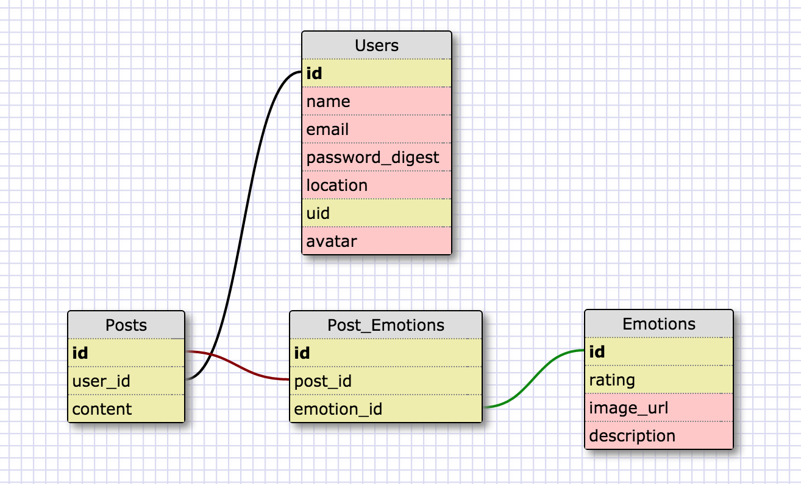
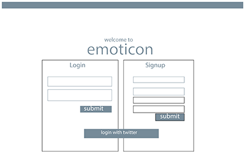
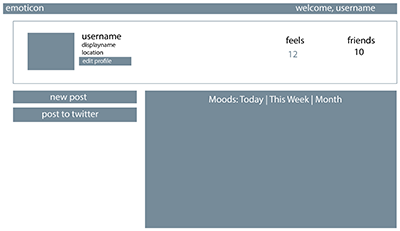
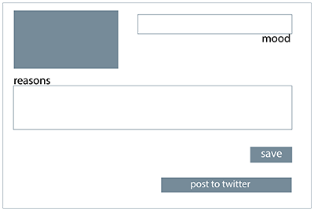

#Emoticom
Emoticom is a web application where users can post their 'moods' that includes a small description. Each mood the user posts comes with a pre-set rating. As the user posts their moods throughout the day, they will be able to view a visualization of their mood fluctuations. 

###Technologies
_Current_
```
* Ruby on Rails
* Firebase
* Twitter API
* Bootstrap
```

_Future_
```
* GoogleMaps API
* D3.js
```

###Schema


###Wireframes
 



###User Stories
```
* As a user, I want to login/logout via Twitter.
* As a user, I want to login/logout through the website.
* As a user, I want to post an emoticon with my emotion.
* As a user, I want to see my timeline of emotions.
* As a user, I want to see my mood fluctuations throughout the day.
* As a user, I want to post my emoticom post to Twitter.
* As a user, I want to add friends who also use Emoticom.
* As a user, I want to see my friend's emoticom posts and their mood fluctuations.
```
