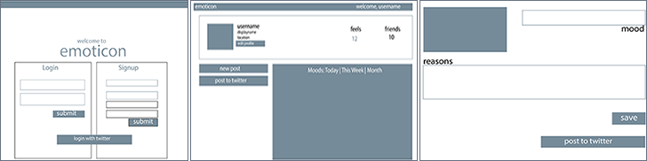
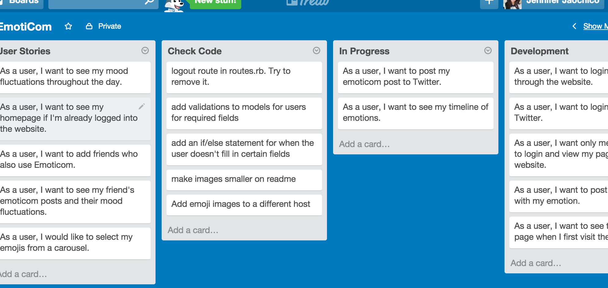

#Emoticom
Emoticom is a web application where users can post their 'moods' that includes a small description. Each mood the user posts comes with a pre-set rating. As the user posts their moods throughout the day, they will be able to view a visualization of their mood fluctuations. 

###Technologies
_Current_
```
* Ruby on Rails
* Firebase
* Twitter API
* Bootstrap
```

_Future_
```
* GoogleMaps API
* D3.js
* Rspec 
```


###Wireframes
 

###Schema


###User Stories
As a user, I want to...
```
* login/logout via Twitter
* login/logout through the website
* post an emoticon with my emotion
* see my timeline of emotions
* As a user, I want to see my mood fluctuations throughout the day
* post my emoticom post to Twitter
* add friends who also use Emoticom
* see my friend's emoticom posts and their mood fluctuations
```
###Future Goals
```
* Create a mobile-app version
* Decoupled
```

### Keeping Organized
Using Trello to keep track of features


